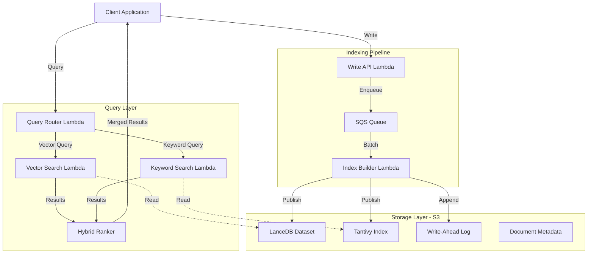
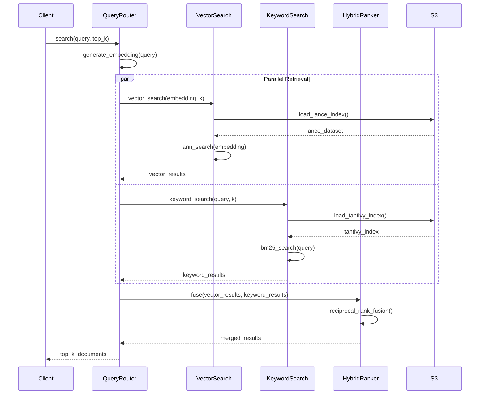

# Design Document: Serverless Hybrid Search Engine

## Overview

This design document specifies a serverless hybrid search system that combines vector similarity search (LanceDB) with keyword search (Tantivy BM25) to provide high-quality retrieval for RAG pipelines and document search workloads. The system is built on AWS Lambda for compute and S3 for storage, emphasizing low operational cost, serverless scalability, and simplified management.

The architecture supports moderate traffic (~20 QPS average, burst to 500 QPS) with sub-300ms latency SLA, handling datasets up to 10M documents with index sizes of 20-40GB. Updates are processed through near-real-time batch indexing with 1-5 minute latency, using versioned index publishing for atomic updates and zero-downtime deployments.

Key design principles include compute-storage separation (stateless Lambda + persistent S3), serverless execution model (no always-running infrastructure), and hybrid retrieval using Reciprocal Rank Fusion (RRF) to merge vector and keyword results.

## Architecture

The system follows a layered architecture with clear separation between query execution, storage, and indexing pipelines.



## Main Algorithm/Workflow



## Components and Interfaces

### Component 1: Query Router

**Purpose**: Orchestrates hybrid search by coordinating vector and keyword search, then merging results.

**Interface**:
```rust
pub struct QueryRouter {
    vector_searcher: Arc<VectorSearcher>,
    keyword_searcher: Arc<KeywordSearcher>,
    ranker: HybridRanker,
}

impl QueryRouter {
    pub async fn search(&self, request: SearchRequest) -> Result<SearchResponse, SearchError>;
    pub async fn health_check(&self) -> Result<HealthStatus, Error>;
}
```

**Responsibilities**:
- Generate query embeddings
- Coordinate parallel retrieval from vector and keyword search
- Merge results using hybrid ranking
- Handle query routing and load balancing

### Component 2: Vector Searcher

**Purpose**: Performs approximate nearest neighbor (ANN) search using LanceDB for vector similarity retrieval.

**Interface**:
```rust
pub struct VectorSearcher {
    lance_dataset: Arc<LanceDataset>,
    cache: IndexCache,
}

impl VectorSearcher {
    pub async fn search(&self, embedding: Vec<f32>, top_k: usize) -> Result<Vec<SearchResult>, SearchError>;
    pub async fn load_index(&mut self, version: IndexVersion) -> Result<(), IndexError>;
    pub fn cache_stats(&self) -> CacheStats;
}
```

**Responsibilities**:
- Load LanceDB dataset from S3 or /tmp cache
- Execute ANN search on vector embeddings
- Manage index cache in Lambda /tmp storage
- Return ranked results with similarity scores

### Component 3: Keyword Searcher

**Purpose**: Performs BM25 keyword search using Tantivy for lexical retrieval.

**Interface**:
```rust
pub struct KeywordSearcher {
    tantivy_index: Arc<TantivyIndex>,
    cache: IndexCache,
}

impl KeywordSearcher {
    pub async fn search(&self, query: &str, top_k: usize) -> Result<Vec<SearchResult>, SearchError>;
    pub async fn load_index(&mut self, version: IndexVersion) -> Result<(), IndexError>;
    pub fn cache_stats(&self) -> CacheStats;
}
```

**Responsibilities**:
- Load Tantivy index from S3 or /tmp cache
- Parse and execute BM25 queries
- Manage index cache in Lambda /tmp storage
- Return ranked results with BM25 scores

### Component 4: Hybrid Ranker

**Purpose**: Merges vector and keyword search results using Reciprocal Rank Fusion (RRF).

**Interface**:
```rust
pub struct HybridRanker {
    rrf_k: f32,
}

impl HybridRanker {
    pub fn fuse(&self, vector_results: Vec<SearchResult>, keyword_results: Vec<SearchResult>) -> Vec<SearchResult>;
    pub fn compute_rrf_score(&self, rank: usize) -> f32;
}
```

**Responsibilities**:
- Implement Reciprocal Rank Fusion algorithm
- Merge and deduplicate results from multiple sources
- Produce final ranked result list

### Component 5: Index Builder

**Purpose**: Processes document batches and builds versioned indexes for both vector and keyword search.

**Interface**:
```rust
pub struct IndexBuilder {
    s3_client: Arc<S3Client>,
    embedding_generator: Arc<EmbeddingGenerator>,
}

impl IndexBuilder {
    pub async fn build_index(&self, documents: Vec<Document>) -> Result<IndexVersion, IndexError>;
    pub async fn publish_index(&self, version: IndexVersion) -> Result<(), PublishError>;
    pub async fn rollback_index(&self, version: IndexVersion) -> Result<(), PublishError>;
}
```

**Responsibilities**:
- Consume document batches from SQS queue
- Generate embeddings for documents
- Build LanceDB and Tantivy indexes
- Publish versioned indexes to S3
- Update index version pointer atomically

### Component 6: Write API

**Purpose**: Accepts document write requests and enqueues them for batch processing.

**Interface**:
```rust
pub struct WriteAPI {
    sqs_client: Arc<SqsClient>,
    wal: Arc<WriteAheadLog>,
}

impl WriteAPI {
    pub async fn ingest(&self, documents: Vec<Document>) -> Result<IngestResponse, IngestError>;
    pub async fn delete(&self, doc_ids: Vec<String>) -> Result<DeleteResponse, IngestError>;
}
```

**Responsibilities**:
- Validate incoming documents
- Append to write-ahead log (WAL)
- Enqueue documents to SQS for batch processing
- Return acknowledgment to client

## Data Models

### Model 1: SearchRequest

```rust
pub struct SearchRequest {
    pub query: String,
    pub top_k: usize,
    pub filters: Option<HashMap<String, FilterValue>>,
    pub include_metadata: bool,
}
```

**Validation Rules**:
- query must be non-empty string (1-1000 characters)
- top_k must be in range [1, 100]
- filters must contain valid field names and values

### Model 2: SearchResult

```rust
pub struct SearchResult {
    pub doc_id: String,
    pub score: f32,
    pub text: String,
    pub metadata: Option<HashMap<String, serde_json::Value>>,
    pub source: SearchSource,
}

pub enum SearchSource {
    Vector,
    Keyword,
    Hybrid,
}
```

**Validation Rules**:
- doc_id must be non-empty string
- score must be finite positive number
- text must be valid UTF-8 string
- metadata must be valid JSON object if present

### Model 3: Document

```rust
pub struct Document {
    pub doc_id: String,
    pub text: String,
    pub embedding: Option<Vec<f32>>,
    pub metadata: HashMap<String, serde_json::Value>,
    pub timestamp: i64,
}
```

**Validation Rules**:
- doc_id must be unique, non-empty string (max 256 chars)
- text must be non-empty string (max 100KB)
- embedding must be 768-dimensional vector if present
- metadata must be valid JSON object (max 10KB)
- timestamp must be Unix epoch milliseconds

### Model 4: IndexVersion

```rust
pub struct IndexVersion {
    pub version_id: u64,
    pub lance_path: String,
    pub tantivy_path: String,
    pub document_count: usize,
    pub created_at: i64,
}
```

**Validation Rules**:
- version_id must be monotonically increasing
- paths must be valid S3 URIs
- document_count must be non-negative
- created_at must be valid Unix timestamp

### Model 5: IndexCache

```rust
pub struct IndexCache {
    pub cache_dir: PathBuf,
    pub max_size_bytes: u64,
    pub current_version: Option<IndexVersion>,
}
```

**Validation Rules**:
- cache_dir must be within /tmp directory
- max_size_bytes must not exceed 10GB (Lambda limit)
- current_version must match cached data if present

## Key Functions with Formal Specifications

### Function 1: search()

```rust
pub async fn search(
    &self,
    request: SearchRequest
) -> Result<SearchResponse, SearchError>
```

**Preconditions:**
- `request.query` is non-empty string
- `request.top_k` is in range [1, 100]
- Vector and keyword searchers are initialized
- Index cache contains valid index version

**Postconditions:**
- Returns SearchResponse with `static_chunks` and `dynamic_chunks`, each holding
  up to `3 * top_k` candidates (the retrieval window), not truncated to `top_k`
  — see the TurboQuant hybrid spec §5.6. `top_k` is the K base.
- Results within each group are sorted by descending score
- All returned doc_ids are unique within a group
- If successful: `static_chunks.len()`/`dynamic_chunks.len()` each `<= 3 * top_k`
- If error: returns descriptive SearchError
- No mutations to request parameter

**Loop Invariants:** N/A (async parallel execution)

### Function 2: vector_search()

```rust
pub async fn search(
    &self,
    embedding: Vec<f32>,
    top_k: usize
) -> Result<Vec<SearchResult>, SearchError>
```

**Preconditions:**
- `embedding` is 768-dimensional vector
- `top_k` is in range [1, 100]
- LanceDB dataset is loaded in memory or cache
- All embedding values are finite

**Postconditions:**
- Returns at most `top_k` results
- Results are sorted by descending similarity score
- All scores are in range [0.0, 1.0]
- No duplicate doc_ids in results
- Index state remains unchanged (read-only operation)

**Loop Invariants:**
- During ANN search: all visited nodes maintain heap property
- All processed results have valid similarity scores

### Function 3: keyword_search()

```rust
pub async fn search(
    &self,
    query: &str,
    top_k: usize
) -> Result<Vec<SearchResult>, SearchError>
```

**Preconditions:**
- `query` is non-empty string
- `top_k` is in range [1, 100]
- Tantivy index is loaded and valid
- Query can be parsed by Tantivy query parser

**Postconditions:**
- Returns at most `top_k` results
- Results are sorted by descending BM25 score
- All scores are positive finite numbers
- No duplicate doc_ids in results
- Index state remains unchanged (read-only operation)

**Loop Invariants:**
- During BM25 scoring: all document frequencies remain consistent
- All processed results have valid BM25 scores

### Function 4: fuse()

```rust
pub fn fuse(
    &self,
    vector_results: Vec<SearchResult>,
    keyword_results: Vec<SearchResult>
) -> Vec<SearchResult>
```

**Preconditions:**
- `vector_results` is sorted by descending score
- `keyword_results` is sorted by descending score
- All doc_ids in both lists are valid
- `rrf_k` parameter is positive

**Postconditions:**
- Returns merged and deduplicated results
- Results are sorted by descending RRF score
- All doc_ids are unique
- Result count <= vector_results.len() + keyword_results.len()
- No mutations to input parameters

**Loop Invariants:**
- For each result processed: RRF score correctly computed from ranks
- All previously processed results maintain sorted order

### Function 5: build_index()

```rust
pub async fn build_index(
    &self,
    documents: Vec<Document>
) -> Result<IndexVersion, IndexError>
```

**Preconditions:**
- `documents` is non-empty vector
- All documents have valid doc_ids and text
- Embeddings are generated or provided
- S3 client is initialized and has write permissions

**Postconditions:**
- Returns new IndexVersion with incremented version_id
- LanceDB dataset is created and uploaded to S3
- Tantivy index is created and uploaded to S3
- All documents are indexed in both systems
- If error: no partial index is published
- Original documents vector is consumed (moved)

**Loop Invariants:**
- For each document processed: embedding dimension is 768
- All indexed documents maintain referential integrity
- Index build progress is monotonically increasing

### Function 6: publish_index()

```rust
pub async fn publish_index(
    &self,
    version: IndexVersion
) -> Result<(), PublishError>
```

**Preconditions:**
- `version` references valid index files in S3
- Index files are complete and valid
- _head pointer exists in S3

**Postconditions:**
- _head pointer is atomically updated to new version
- New version becomes active for all subsequent queries
- Previous version remains available for rollback
- Operation is atomic (either fully succeeds or fully fails)

`_head.manifest_path` stores the canonical bucket-relative manifest object key, not a full S3 URI. Its value must match `index/versions/<version_id>/manifest.json` for the active version.

**Loop Invariants:** N/A (atomic operation)

## Algorithmic Pseudocode

### Main Query Processing Algorithm

```rust
// Algorithm: Hybrid Search Query Processing
// Input: request: SearchRequest
// Output: SearchResponse with ranked results

async fn process_query(request: SearchRequest) -> Result<SearchResponse, SearchError> {
    // Precondition: request is validated
    assert!(validate_request(&request));
    
    // Step 1: Generate query embedding
    let embedding = generate_embedding(&request.query).await?;
    assert!(embedding.len() == 768);
    
    // Step 2: Parallel retrieval from both indexes
    let (vector_results, keyword_results) = tokio::join!(
        vector_search(embedding, request.top_k),
        keyword_search(&request.query, request.top_k)
    );
    
    let vector_results = vector_results?;
    let keyword_results = keyword_results?;
    
    // Invariant: Both result sets are sorted by descending score
    assert!(is_sorted_descending(&vector_results));
    assert!(is_sorted_descending(&keyword_results));
    
    // Step 3: Merge results using RRF
    let merged_results = reciprocal_rank_fusion(
        vector_results,
        keyword_results,
        RRF_K
    );
    
    // Step 4: Apply filters if specified
    let filtered_results = if let Some(filters) = request.filters {
        apply_filters(merged_results, filters)
    } else {
        merged_results
    };
    
    // Step 5: Truncate to top_k
    let final_results: Vec<SearchResult> = filtered_results
        .into_iter()
        .take(request.top_k)
        .collect();
    
    // Postcondition: Results are valid and within limit
    assert!(final_results.len() <= request.top_k);
    assert!(all_unique_doc_ids(&final_results));
    
    Ok(SearchResponse {
        results: final_results,
        total_count: final_results.len(),
        latency_ms: measure_latency(),
    })
}
```

**Preconditions:**
- request is validated and well-formed
- Vector and keyword indexes are loaded
- Embedding generator is available

**Postconditions:**
- Returns SearchResponse with at most top_k results
- All results are unique and sorted by score
- Latency is measured and included

**Loop Invariants:**
- Result sets maintain sorted order throughout processing
- All doc_ids remain unique after each transformation

### Reciprocal Rank Fusion Algorithm

```rust
// Algorithm: Reciprocal Rank Fusion (RRF)
// Input: vector_results, keyword_results (both sorted by score)
// Output: merged results sorted by RRF score

fn reciprocal_rank_fusion(
    vector_results: Vec<SearchResult>,
    keyword_results: Vec<SearchResult>,
    k: f32
) -> Vec<SearchResult> {
    // Precondition: Both inputs are sorted by descending score
    assert!(is_sorted_descending(&vector_results));
    assert!(is_sorted_descending(&keyword_results));
    
    let mut rrf_scores: HashMap<String, f32> = HashMap::new();
    let mut doc_map: HashMap<String, SearchResult> = HashMap::new();
    
    // Step 1: Compute RRF scores from vector results
    for (rank, result) in vector_results.into_iter().enumerate() {
        let rrf_score = 1.0 / (k + (rank as f32 + 1.0));
        *rrf_scores.entry(result.doc_id.clone()).or_insert(0.0) += rrf_score;
        doc_map.insert(result.doc_id.clone(), result);
    }
    
    // Invariant: All processed vector results have RRF contribution
    assert!(rrf_scores.len() == doc_map.len());
    
    // Step 2: Add RRF scores from keyword results
    for (rank, result) in keyword_results.into_iter().enumerate() {
        let rrf_score = 1.0 / (k + (rank as f32 + 1.0));
        *rrf_scores.entry(result.doc_id.clone()).or_insert(0.0) += rrf_score;
        doc_map.entry(result.doc_id.clone()).or_insert(result);
    }
    
    // Step 3: Sort by RRF score descending
    let mut merged: Vec<(String, f32)> = rrf_scores.into_iter().collect();
    merged.sort_by(|a, b| b.1.partial_cmp(&a.1).unwrap());
    
    // Step 4: Build final result list
    let final_results: Vec<SearchResult> = merged
        .into_iter()
        .map(|(doc_id, rrf_score)| {
            let mut result = doc_map.remove(&doc_id).unwrap();
            result.score = rrf_score;
            result.source = SearchSource::Hybrid;
            result
        })
        .collect();
    
    // Postcondition: All doc_ids are unique and sorted by RRF score
    assert!(all_unique_doc_ids(&final_results));
    assert!(is_sorted_descending(&final_results));
    
    final_results
}
```

**Preconditions:**
- vector_results and keyword_results are sorted by descending score
- k parameter is positive (typically 60.0)
- All doc_ids are valid strings

**Postconditions:**
- Returns merged results sorted by descending RRF score
- All doc_ids are unique (deduplicated)
- Result count <= vector_results.len() + keyword_results.len()

**Loop Invariants:**
- All processed results have valid RRF score contribution
- doc_map maintains one-to-one mapping with doc_ids

### Index Building Algorithm

```rust
// Algorithm: Batch Index Building
// Input: documents (batch of documents to index)
// Output: IndexVersion with new version metadata

async fn build_index(documents: Vec<Document>) -> Result<IndexVersion, IndexError> {
    // Precondition: Documents are validated
    assert!(!documents.is_empty());
    assert!(all_valid_documents(&documents));
    
    let version_id = get_next_version_id().await?;
    let lance_path = format!("s3://bucket/lance/v{}", version_id);
    let tantivy_path = format!("s3://bucket/index/v{}", version_id);
    
    // Step 1: Generate embeddings for documents without them
    let mut enriched_docs = Vec::with_capacity(documents.len());
    for doc in documents {
        let embedding = if let Some(emb) = doc.embedding {
            emb
        } else {
            generate_embedding(&doc.text).await?
        };
        
        // Invariant: All embeddings are 768-dimensional
        assert!(embedding.len() == 768);
        
        enriched_docs.push(Document {
            embedding: Some(embedding),
            ..doc
        });
    }
    
    // Step 2: Build LanceDB dataset
    let lance_builder = LanceDatasetBuilder::new();
    for doc in &enriched_docs {
        lance_builder.add_row(
            &doc.doc_id,
            doc.embedding.as_ref().unwrap(),
            &doc.text,
            &doc.metadata
        )?;
    }
    let lance_dataset = lance_builder.build()?;
    
    // Step 3: Build Tantivy index
    let tantivy_builder = TantivyIndexBuilder::new();
    for doc in &enriched_docs {
        tantivy_builder.add_document(
            &doc.doc_id,
            &doc.text,
            &doc.metadata
        )?;
    }
    let tantivy_index = tantivy_builder.build()?;
    
    // Invariant: Both indexes contain same document count
    assert!(lance_dataset.count() == tantivy_index.count());
    assert!(lance_dataset.count() == enriched_docs.len());
    
    // Step 4: Upload to S3
    upload_to_s3(&lance_dataset, &lance_path).await?;
    upload_to_s3(&tantivy_index, &tantivy_path).await?;
    
    // Step 5: Create version metadata
    let index_version = IndexVersion {
        version_id,
        lance_path,
        tantivy_path,
        document_count: enriched_docs.len(),
        created_at: current_timestamp(),
    };
    
    // Postcondition: Valid index version created
    assert!(index_version.document_count == enriched_docs.len());
    
    Ok(index_version)
}
```

**Preconditions:**
- documents is non-empty vector
- All documents have valid doc_ids and text
- S3 client has write permissions

**Postconditions:**
- New IndexVersion is created with incremented version_id
- Both LanceDB and Tantivy indexes are built and uploaded
- All documents are indexed in both systems
- Document counts match across both indexes

**Loop Invariants:**
- All processed documents have 768-dimensional embeddings
- Both indexes maintain consistent document counts

### Index Cache Management Algorithm

```rust
// Algorithm: Lambda Index Cache Management
// Input: version (target index version to load)
// Output: Loaded index in /tmp cache

async fn load_index_with_cache(version: IndexVersion) -> Result<(), IndexError> {
    let cache_dir = PathBuf::from("/tmp/search_index");
    let version_marker = cache_dir.join("version.txt");
    
    // Step 1: Check if correct version is already cached
    if cache_dir.exists() && version_marker.exists() {
        let cached_version = read_version_marker(&version_marker)?;
        
        if cached_version == version.version_id {
            // Cache hit - reuse existing index
            return Ok(());
        }
    }
    
    // Step 2: Cache miss - clear old cache
    if cache_dir.exists() {
        remove_dir_all(&cache_dir)?;
    }
    create_dir_all(&cache_dir)?;
    
    // Step 3: Download index from S3
    let lance_cache = cache_dir.join("lance");
    let tantivy_cache = cache_dir.join("tantivy");
    
    download_from_s3(&version.lance_path, &lance_cache).await?;
    download_from_s3(&version.tantivy_path, &tantivy_cache).await?;
    
    // Step 4: Verify cache size constraint
    let cache_size = calculate_dir_size(&cache_dir)?;
    assert!(cache_size <= 10 * 1024 * 1024 * 1024); // 10 GB limit
    
    // Step 5: Write version marker
    write_version_marker(&version_marker, version.version_id)?;
    
    // Postcondition: Cache contains correct version
    assert!(cache_dir.exists());
    assert!(read_version_marker(&version_marker)? == version.version_id);
    
    Ok(())
}
```

**Preconditions:**
- version references valid index files in S3
- /tmp directory is writable
- Sufficient space available in /tmp (up to 10 GB)

**Postconditions:**
- Index is loaded in /tmp cache directory
- Version marker file indicates cached version
- Cache size does not exceed 10 GB limit
- Old cache is cleared if version mismatch

**Loop Invariants:** N/A (sequential operations)

## Example Usage

```rust
// Example 1: Basic hybrid search query
use serverless_search::{QueryRouter, SearchRequest};

#[tokio::main]
async fn main() -> Result<(), Box<dyn std::error::Error>> {
    let router = QueryRouter::new().await?;
    
    let request = SearchRequest {
        query: "serverless vector database".to_string(),
        top_k: 10,
        filters: None,
        include_metadata: true,
    };
    
    let response = router.search(request).await?;
    
    for result in response.results {
        println!("Doc: {} | Score: {:.4} | Source: {:?}",
            result.doc_id, result.score, result.source);
    }
    
    Ok(())
}
```

// Example 2: Document ingestion
use serverless_search::{WriteAPI, Document};
use std::collections::HashMap;

#[tokio::main]
async fn main() -> Result<(), Box<dyn std::error::Error>> {
    let write_api = WriteAPI::new().await?;
    
    let documents = vec![
        Document {
            doc_id: "doc_001".to_string(),
            text: "Serverless computing with AWS Lambda".to_string(),
            embedding: None, // Will be generated
            metadata: HashMap::from([
                ("category".to_string(), json!("technology")),
                ("author".to_string(), json!("Alice")),
            ]),
            timestamp: chrono::Utc::now().timestamp_millis(),
        },
        Document {
            doc_id: "doc_002".to_string(),
            text: "Vector databases for machine learning".to_string(),
            embedding: None,
            metadata: HashMap::from([
                ("category".to_string(), json!("ml")),
                ("author".to_string(), json!("Bob")),
            ]),
            timestamp: chrono::Utc::now().timestamp_millis(),
        },
    ];
    
    let response = write_api.ingest(documents).await?;
    println!("Ingested {} documents", response.count);
    
    Ok(())
}

// Example 3: Index building and publishing
use serverless_search::{IndexBuilder, Document};

#[tokio::main]
async fn main() -> Result<(), Box<dyn std::error::Error>> {
    let builder = IndexBuilder::new().await?;
    
    // Consume batch from SQS
    let documents = consume_document_batch().await?;
    
    // Build new index version
    let version = builder.build_index(documents).await?;
    println!("Built index version: {}", version.version_id);
    
    // Publish atomically
    builder.publish_index(version).await?;
    println!("Index published successfully");
    
    Ok(())
}

// Example 4: Hybrid ranking with custom parameters
use serverless_search::HybridRanker;

fn main() {
    let ranker = HybridRanker { rrf_k: 60.0 };
    
    let vector_results = vec![
        SearchResult { doc_id: "doc_1".into(), score: 0.95, ..Default::default() },
        SearchResult { doc_id: "doc_2".into(), score: 0.87, ..Default::default() },
        SearchResult { doc_id: "doc_3".into(), score: 0.82, ..Default::default() },
    ];
    
    let keyword_results = vec![
        SearchResult { doc_id: "doc_2".into(), score: 12.5, ..Default::default() },
        SearchResult { doc_id: "doc_4".into(), score: 10.3, ..Default::default() },
        SearchResult { doc_id: "doc_1".into(), score: 8.7, ..Default::default() },
    ];
    
    let merged = ranker.fuse(vector_results, keyword_results);
    
    for result in merged {
        println!("Doc: {} | RRF Score: {:.4}", result.doc_id, result.score);
    }
}
```

## Correctness Properties

The following properties must hold for all valid inputs and system states:

### Property 1: Search Result Uniqueness
```rust
// For all search responses, doc_ids must be unique
∀ response: SearchResponse,
  response.results.iter().map(|r| &r.doc_id).collect::<HashSet<_>>().len() 
  == response.results.len()
```

### Property 2: Result Ordering
```rust
// Search results must be sorted by descending score
∀ response: SearchResponse,
  ∀ i, j where 0 <= i < j < response.results.len(),
    response.results[i].score >= response.results[j].score
```

### Property 3: Top-K Constraint
```rust
// Response must contain at most top_k results
∀ request: SearchRequest, response: SearchResponse,
  response.results.len() <= request.top_k
```

### Property 4: RRF Score Correctness
```rust
// RRF score must be computed correctly from ranks
∀ doc_id in merged_results,
  let vector_rank = find_rank(doc_id, vector_results);
  let keyword_rank = find_rank(doc_id, keyword_results);
  let expected_score = 
    (if vector_rank.is_some() { 1.0 / (k + vector_rank.unwrap() + 1.0) } else { 0.0 })
    + (if keyword_rank.is_some() { 1.0 / (k + keyword_rank.unwrap() + 1.0) } else { 0.0 });
  
  merged_results[doc_id].score == expected_score
```

### Property 5: Index Version Consistency
```rust
// All queries within same Lambda execution use same index version
∀ lambda_execution,
  ∀ query1, query2 in lambda_execution,
    query1.index_version == query2.index_version
```

### Property 6: Cache Size Constraint
```rust
// Lambda cache must not exceed 10 GB
∀ cache_state: IndexCache,
  calculate_dir_size(&cache_state.cache_dir) <= 10 * 1024 * 1024 * 1024
```

### Property 7: Embedding Dimension Consistency
```rust
// All embeddings must be 768-dimensional
∀ document: Document where document.embedding.is_some(),
  document.embedding.unwrap().len() == 768
```

### Property 8: Atomic Index Publishing
```rust
// Index publish is atomic - either fully succeeds or fully fails
∀ publish_operation,
  (lance_published ∧ tantivy_published ∧ head_updated) 
  ∨ (¬lance_published ∧ ¬tantivy_published ∧ ¬head_updated)
```

### Property 9: Document Count Consistency
```rust
// Both indexes must contain same document count
∀ index_version: IndexVersion,
  lance_dataset.count() == tantivy_index.count() 
  == index_version.document_count
```

### Property 10: Latency SLA
```rust
// Query latency must not exceed 300ms (excluding cold starts)
∀ query with warm_cache,
  query.latency_ms <= 300
```

## Error Handling

### Error Scenario 1: Index Cache Miss (Cold Start)

**Condition**: Lambda container starts without cached index or version mismatch
**Response**: 
- Download index from S3 to /tmp cache
- Verify index integrity
- Update version marker
- Proceed with query execution

**Recovery**: 
- Subsequent requests in same container use cached index
- Expected cold start latency: 2-5 seconds
- Warm request latency: 50-150ms

### Error Scenario 2: S3 Download Failure

**Condition**: Network error or S3 unavailability during index download
**Response**:
- Retry with exponential backoff (3 attempts)
- Return 503 Service Unavailable to client
- Log error with request ID for debugging

**Recovery**:
- Client retries request
- May hit different Lambda with cached index
- CloudWatch alarm triggers if error rate exceeds threshold

### Error Scenario 3: Cache Size Exceeded

**Condition**: Index size exceeds 10 GB Lambda /tmp limit
**Response**:
- Fail index load operation
- Return 500 Internal Server Error
- Alert operations team via CloudWatch alarm

**Recovery**:
- Implement index sharding to reduce per-shard size
- Increase shard count to distribute index
- Consider index compression techniques

### Error Scenario 4: Invalid Query Input

**Condition**: Client sends malformed query (empty string, invalid top_k, etc.)
**Response**:
- Validate request parameters
- Return 400 Bad Request with descriptive error message
- Do not invoke search operations

**Recovery**:
- Client corrects request and retries
- No system state changes

### Error Scenario 5: Embedding Generation Failure

**Condition**: Embedding model unavailable or returns error
**Response**:
- Retry embedding generation (2 attempts)
- If still failing, fall back to keyword-only search
- Log warning with request details

**Recovery**:
- Return keyword search results only
- Monitor embedding service health
- Alert if failure rate exceeds threshold

### Error Scenario 6: Index Build Failure

**Condition**: Index builder fails during batch processing (OOM, invalid data, etc.)
**Response**:
- Rollback partial index build
- Move failed batch to dead-letter queue (DLQ)
- Do not publish incomplete index
- Log error with batch details

**Recovery**:
- Investigate failed documents in DLQ
- Fix data issues and reprocess
- Subsequent batches continue processing normally

### Error Scenario 7: Index Publish Race Condition

**Condition**: Multiple index builders attempt to publish simultaneously
**Response**:
- Use S3 conditional writes for _head pointer
- Only one publish succeeds atomically
- Failed publishers detect conflict and abort

**Recovery**:
- Failed publisher logs warning
- Next batch will publish successfully
- No data loss or corruption

### Error Scenario 8: Lambda Timeout

**Condition**: Query execution exceeds Lambda timeout (30 seconds)
**Response**:
- Lambda terminates execution
- Return 504 Gateway Timeout to client
- Log timeout event with query details

**Recovery**:
- Client retries with exponential backoff
- Investigate slow queries (complex filters, large result sets)
- Consider query optimization or timeout increase

## Testing Strategy

### Unit Testing Approach

Unit tests focus on individual components and functions in isolation.

**Key Test Cases**:
- RRF score computation with various rank combinations
- Search result deduplication and sorting
- Index cache management (hit/miss scenarios)
- Request validation (boundary conditions, invalid inputs)
- Embedding dimension validation

**Coverage Goals**:
- 90% code coverage for core algorithms
- 100% coverage for RRF fusion logic
- All error paths tested

**Testing Framework**: Rust's built-in test framework with `cargo test`

### Property-Based Testing Approach

Property-based tests verify correctness properties hold for all valid inputs.

**Property Test Library**: proptest (Rust property testing framework)

**Key Properties to Test**:
1. Search result uniqueness (no duplicate doc_ids)
2. Result ordering (descending score)
3. Top-K constraint (result count <= top_k)
4. RRF score correctness (matches formula)
5. Cache size constraint (never exceeds 10 GB)
6. Embedding dimension consistency (always 768)

**Example Property Test**:
```rust
use proptest::prelude::*;

proptest! {
    #[test]
    fn test_rrf_produces_unique_sorted_results(
        vector_results in prop::collection::vec(arbitrary_search_result(), 1..20),
        keyword_results in prop::collection::vec(arbitrary_search_result(), 1..20),
    ) {
        let ranker = HybridRanker { rrf_k: 60.0 };
        let merged = ranker.fuse(vector_results, keyword_results);
        
        // Property 1: All doc_ids are unique
        let doc_ids: HashSet<_> = merged.iter().map(|r| &r.doc_id).collect();
        prop_assert_eq!(doc_ids.len(), merged.len());
        
        // Property 2: Results are sorted by descending score
        for i in 0..merged.len().saturating_sub(1) {
            prop_assert!(merged[i].score >= merged[i + 1].score);
        }
    }
}
```

### Integration Testing Approach

Integration tests verify end-to-end workflows with real AWS services (using Moto for local testing).

**Key Integration Tests**:
- Complete query pipeline (embedding → vector search → keyword search → fusion)
- Index build and publish workflow
- Cache management across Lambda invocations
- S3 index versioning and atomic updates
- SQS batch processing

**Test Environment**:
- Moto for S3 and SQS simulation
- In-memory LanceDB and Tantivy indexes
- Mock embedding service

**Test Data**:
- Synthetic document corpus (1000-10000 documents)
- Realistic query patterns
- Edge cases (empty results, large batches, etc.)

## Performance Considerations

### Query Latency Breakdown

Target latency budget (300ms SLA):
- Embedding generation: 20-40ms (13%)
- Vector search (LanceDB): 40-80ms (27%)
- Keyword search (Tantivy): 10-30ms (10%)
- RRF fusion: <5ms (2%)
- Network overhead: 20-40ms (13%)
- Buffer: 100-150ms (35%)

### Cold Start Optimization

**Problem**: Lambda cold starts add 2-5 seconds latency

**Mitigation Strategies**:
- Provisioned concurrency for baseline traffic (2-5 instances)
- Lazy index loading (load on first query, not on init)
- Index compression to reduce download time
- CloudFront caching for frequently accessed index versions

### Index Sharding Strategy

**Problem**: Large indexes exceed 10 GB cache limit

**Solution**: Partition index into 8-16 shards
- Shard assignment: `shard_id = hash(doc_id) % num_shards`
- Query fan-out: parallel Lambda invocations per shard
- Result aggregation: merge results from all shards

**Trade-offs**:
- Increased Lambda invocations (cost)
- Reduced per-Lambda memory requirements
- Parallel execution improves latency

### Memory Management

**Lambda Memory Configuration**: 3-10 GB
- Base runtime: ~500 MB
- LanceDB dataset: 2-8 GB (depends on shard size)
- Tantivy index: 1-3 GB (depends on shard size)
- Query processing: ~100-500 MB

**Optimization Techniques**:
- Memory-mapped file I/O for indexes
- Streaming result processing
- Aggressive deallocation after query completion

### Throughput Scaling

**Baseline Traffic (20 QPS)**:
- 2-5 warm Lambda instances
- Average concurrency: 4-6
- Cost: ~$15-20/month

**Burst Traffic (500 QPS)**:
- Auto-scale to 100-150 Lambda instances
- Concurrency limit: 1000 (AWS default)
- Cost during burst: ~$0.50-1.00 per hour

**Scaling Characteristics**:
- Linear scaling up to 500 QPS
- Bottleneck: S3 request rate (5500 req/sec per prefix)
- Mitigation: Use multiple S3 prefixes for shards

## Security Considerations

### Authentication and Authorization

**API Gateway Integration**:
- AWS IAM authentication for service-to-service
- API keys for external clients
- JWT tokens for user authentication

**Lambda Execution Role**:
- Least privilege IAM policy
- Read-only access to S3 index buckets
- Write access to CloudWatch Logs
- No cross-account access

### Data Encryption

**At Rest**:
- S3 server-side encryption (SSE-KMS)
- Customer-managed KMS keys
- Automatic key rotation enabled

**In Transit**:
- TLS 1.3 for all API communications
- VPC endpoints for S3 access (no internet routing)
- Encrypted Lambda environment variables

### Tenant Isolation

**Multi-Tenant Strategy**:
- S3 prefix per tenant: `s3://bucket/{tenant_id}/index/`
- Lambda environment variable for tenant context
- Query-time filtering by tenant_id
- No cross-tenant data leakage

**Access Control**:
- IAM policies scoped to tenant prefixes
- CloudWatch Logs separated by tenant
- Audit trail for all data access

### Secrets Management

**Sensitive Configuration**:
- AWS Secrets Manager for API keys
- KMS encryption for secrets
- Automatic secret rotation
- No secrets in Lambda code or environment variables

### Network Security

**VPC Configuration**:
- Lambda functions in private subnets
- VPC endpoints for S3 and SQS (no NAT gateway needed)
- Security groups restrict outbound traffic
- No public IP addresses

**DDoS Protection**:
- API Gateway throttling (burst: 5000, steady: 10000 req/sec)
- AWS WAF rules for common attack patterns
- CloudFront rate limiting

## Dependencies

### Core Runtime Dependencies

**Rust Crates**:
- `tokio` (1.35+): Async runtime
- `aws-sdk-s3` (1.10+): S3 client
- `aws-sdk-sqs` (1.10+): SQS client
- `lambda_runtime` (0.9+): AWS Lambda runtime for Rust
- `serde` (1.0+): Serialization/deserialization
- `serde_json` (1.0+): JSON handling

**Search Libraries**:
- `lancedb` (0.4+): Vector search engine
- `tantivy` (0.21+): Full-text search engine
- `arrow` (50.0+): Columnar data format (LanceDB dependency)

**Embedding Generation**:
- HTTP client for embedding API calls
- `reqwest` (0.11+): HTTP client
- `tokenizers` (0.15+): Text tokenization (optional local embeddings)

### AWS Services

**Compute**:
- AWS Lambda (Rust runtime via custom runtime or provided.al2)
- Lambda function memory: 3-10 GB
- Lambda timeout: 30 seconds (query), 15 minutes (indexing)

**Storage**:
- Amazon S3 (Standard storage class)
- S3 bucket versioning enabled
- S3 lifecycle policies for old index cleanup

**Messaging**:
- Amazon SQS (Standard queue)
- Message retention: 4 days
- Dead-letter queue for failed batches

**Monitoring**:
- Amazon CloudWatch Logs
- Amazon CloudWatch Metrics
- AWS X-Ray for distributed tracing

**Security**:
- AWS IAM for authentication/authorization
- AWS KMS for encryption key management
- AWS Secrets Manager for API keys

### External Services (Optional)

**Embedding Generation**:
- OpenAI API (text-embedding-ada-002 or text-embedding-3-small)
- Cohere Embed API
- Self-hosted embedding service (SageMaker, HuggingFace)

**Reranking (Optional)**:
- Cohere Rerank API
- SageMaker Serverless Inference (cross-encoder model)
- Self-hosted reranker service

### Development and Testing

**Build Tools**:
- Rust toolchain (1.75+)
- `cargo-lambda` for Lambda deployment
- `cross` for cross-compilation to x86_64-unknown-linux-gnu

**Testing**:
- `proptest` (1.4+): Property-based testing
- `mockall` (0.12+): Mocking framework
- Moto (3.0+): Local AWS service emulation

**CI/CD**:
- GitHub Actions or AWS CodePipeline
- Automated testing on pull requests
- Canary deployments for production releases
